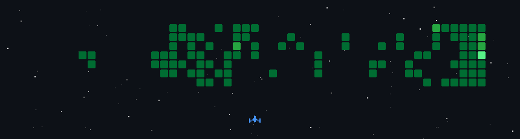

  <h1 align="center">Pratik Rai</h1>
  <h3 align="center">🌌 Engineering the Infrastructure of Tomorrow</h3>

  

     
    &nbsp;
    
    &nbsp;
    
    &nbsp;
    
  

   

  

    I am a Computer Science undergraduate specializing in <b>IoT, AI, and Blockchain</b> at <b>YCCE Nagpur</b>. 
    My work sits at the intersection of scalable engineering and high-level foundational technology.
  

 

---

### 🏆 The Track Record
* **Synapse Lead:** Leading a decorated team of SIH Finalists.
* **Hackathon Veteran:** Winner of **Enduraverse** (₹100K), **HackGenX**, and **BNB Hack Kerala**. Finalist in 13+ national hackathons.
* **IEEE CS @ YCCE:** Vice Chair, leading a community of 300+ members.

---

### 🏗️ Key Architectural Projects
* **[Enduride](https://github.com/raipratik0101)** – A ₹1,139 IoT telematics solution reducing crash alert delays to <5s using Arduino & Solidity.
* **[Evo2 Variant Analysis](https://evo2-variant-analysis.vercel.app/)** – Decentralized genomic research using Google's Evo 2 model and BNB Chain.
* **[DIMO (Roro Birds & Zebra Swap)](https://github.com/raipratik0101)** – Built NFT-based tournament logic and zkSync validation for 1,000+ users.

---

### 🐧 The Daily Driver (Arch BTW)
I live in the terminal. My workflow is optimized for speed and system-level control:
* **OS:** Arch Linux 
* **WM:** Hyprland 
* **Environment:** Heavily customized dots focused on performance and minimalism.

 

<h3 align="center">🕹️ The Contribution Arena</h3>

  

 

<h3 align="center">🛠️ Tech Arsenal</h3>

  <table>
    <tr>
      <td align="center" width="120"><b>Languages</b></td>
      <td>
        
        
        
        
        
        
      </td>
    </tr>
    <tr>
      <td align="center" width="120"><b>Frameworks</b></td>
      <td>
        
        
        
        
      </td>
    </tr>
    <tr>
      <td align="center" width="120"><b>Tools & Infra</b></td>
      <td>
        
        
        
        
        
        
      </td>
    </tr>
  </table>

 

<h3 align="center">📊 The Metrics</h3>

  
   
  
  
   
  
  

 

  <i>"To be the change, you must first build the infrastructure."</i>

